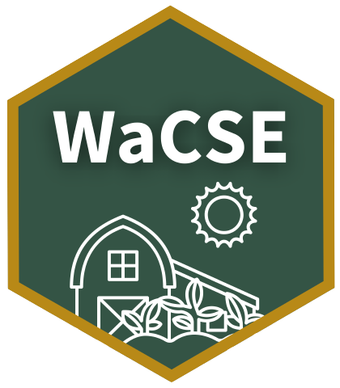

<!-- aboutWaCSE.md is generated from aboutWaCSE.Rmd. Please edit that file -->

```{r, include = FALSE}
knitr::opts_chunk$set(
  collapse = TRUE,
  comment = "#>",
  out.width = "100%"
)
```



# Washington Climate Smart Estimator (WaCSE)

### Who and what is WaCSE for? 

The <a href= "https://agr.wa.gov/departments/land-and-water/natural-resources" target="_blank">Washington State Department of Agriculture</a> developed WaCSE for the Washington State Conservation Commission to use in the <a href="https://www.scc.wa.gov/sff" target="_blank">Sustainable Farms and Fields</a> (SFF) program. Intended users are the Conservation Commission, conservation districts, growers, and anyone interested in reducing agricultural greenhouse gas (GHG) emissions. This interactive tool estimates the reduction of GHG emissions from different conservation practices across Washington’s diverse counties.

### Where do the estimates of GHG emission reductions come from?  

Values were determined by the United States Department of Agriculture's Natural Resources Conservation Service (NRCS). NRCS reviewed field studies and applied a sample-based metamodeling approach to calculate potential GHG emission reduction coefficients. These values are derived from county-rectified major land resource areas (Swan et al. 2020). 

NRCS and Colorado State University developed two tools to estimate impacts on GHG and soil carbon from conservation practices.

- <a href="http://comet-farm.com" target="_blank">**COMET-Farm**</a> is a field-specific tool that requires detailed management and parcel history to estimate the impact of conservation practices.

- <a href="http://comet-planner.com" target="_blank">**COMET-Planner**</a> is a simplified tool that evaluates GHG emission reductions by county rather than by a specific field with specific management history. It provides a more generalized, less accurate GHG reduction estimate, but is easier to use.

### How does WaCSE differ from COMET-Farm and COMET-Planner?

WaCSE uses the COMET-Planner dataset and provides identical estimates. With WaCSE, however, data can be compared between multiple counties and multiple practices at once. WaCSE provides data in tables and bar graphs that can easily be download in spreadsheets and PDFs. WaCSE also helps the user understand their GHG reduction estimate by providing a calculator to convert the emissions data into equivalents from home energy use, consuming gasoline, charging smartphones, and more!

### What do negative values mean?  

Negative values indicate a loss of carbon or increased emissions of GHG (Swan et al. 2020).   

### Where can I find more information about the NRCS conservation practices? 

For technical guides, review the <a href="https://www.nrcs.usda.gov/wps/portal/nrcs/main/national/technical/cp/" target="_blank">NRCS conservation practices standards (CPS)</a>.

### References 

Amy Swan, Mark Easter, Adam Chambers, Kevin Brown, Stephen A. Williams, Jeff Creque, John Wick, Keith Paustian. 2020. COMET-Planner Dataset, Version 2.1, Build 1, and COMET-Planner Report: Carbon and Greenhouse Gas Evaluation for NRCS Conservation Practice Planning. A Companion report to <a href="http://www.comet-planner.com" target = "_blank">COMET-Planner.</a> <a href="http://bfuels.nrel.colostate.edu/beta/COMET-Planner_Report_Final.pdf" target = "_blank">COMET-Planner Final Report PDF.</a>

USDA-NRCS. 2006. Land Resource Regions and Major Land Resource Areas of the United States, the Caribbean, and the Pacific Basin. USDA, Natural Resource Conservation Service, Handbook 296.

### Suggested Citation

When using WaCSE, we appreciate if you include a reference in your publications. To cite the web application, please use:

>Ryan JN, Michel L, Gelardi DL. 2022. WaCSE: A shiny web app for comparing climate benefits of agricultural conservation practices. Natural Resources Assessment Section, Washington Department of Agriculture. [https://github.com/WA-Department-of-Agriculture/WaCSE](https://github.com/WA-Department-of-Agriculture/WaCSE).

### Source Code and Feedback

To view the source code, visit the [GitHub repository](https://github.com/WA-Department-of-Agriculture/WaCSE).

If you have feedback or would like to report a bug, please [submit an issue](https://github.com/WA-Department-of-Agriculture/WaCSE/issues) or contact the app developer: Jadey Ryan at [jryan@agr.wa.gov](mailto:jryan@agr.wa.gov?subject=WaCSE).

