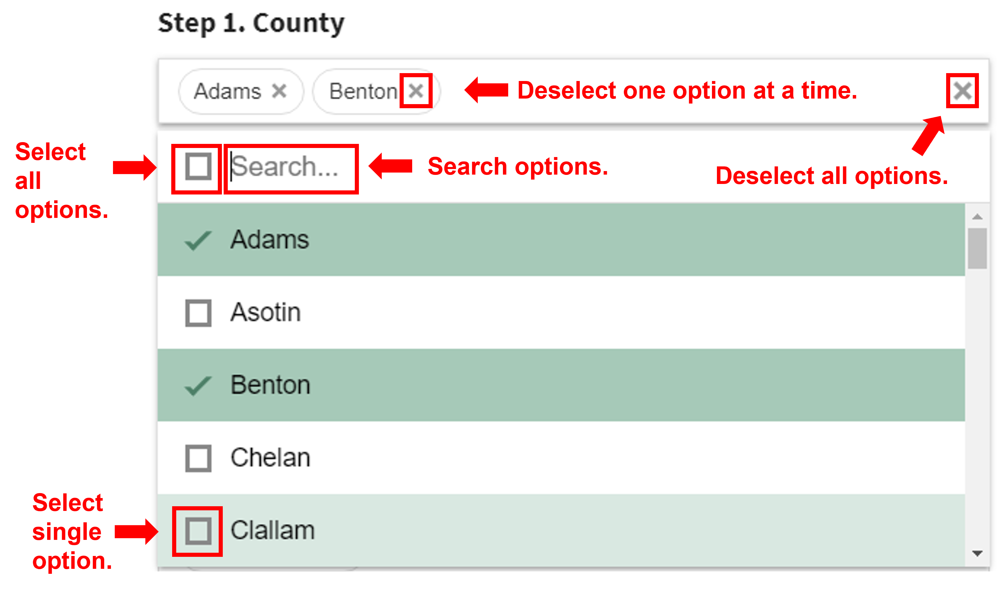

#### Filter the data

------------------------------------------------------------------------

*Conservation Classes* and *Conservation Practices* are from the
<a href="https://www.nrcs.usda.gov/resources/guides-and-instructions/conservation-practice-standards" target="_blank">NRCS
conservation practice standards</a> included in
<a href="http://comet-planner.com/" target="_blank"> COMET-Planner</a>.

**There are multiple options for most practices.** Each step narrows the
options based on your choices.

**The NRCS has not evaluated all practices for every county.** For
example, Hedgerow Planting data are only available in Western Washington

------------------------------------------------------------------------

**How to use:**

<figure>

<figcaption aria-hidden="true">Alt text: Image showing how to deselect
one option at a time, deselect all options, select all options, select a
single option, and search all options.</figcaption>
</figure>
